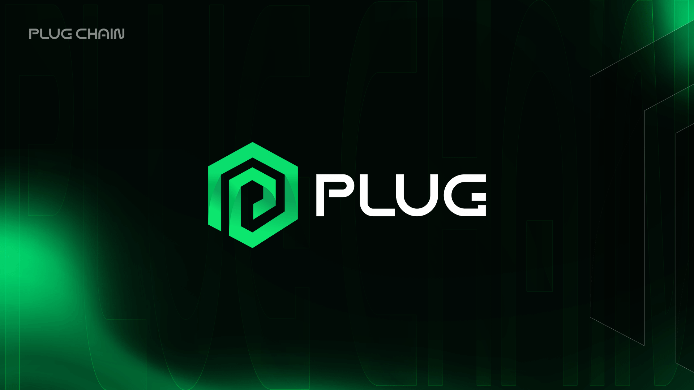

<div align="center">
  <h1>PLUGCHAIN SDK GO</h1>
</div>


<div align="center">
  <a href="https://github.com/oracleNetworkProtocol/plugchain-sdk-go/releases/tag/latest">
    
  </a>
  <a href="https://github.com/oracleNetworkProtocol/plugchain-sdk-go/blob/master/LICENSE">
    
  </a>
   <a href="https://github.com/oracleNetworkProtocol/plugchain-sdk-go">
    
    </a>
    <a href="https://github.com/oracleNetworkProtocol/plugchain-sdk-go/issues">
    
    </a>
</div>

PlugChain GO SDK makes a simple package of API provided by Plug, which provides great convenience for users to quickly
develop applications based on PlugChain.

## install

### Requirement

Go version above 1.13.5

### Use Go Mod

```text
require (
    github.com/oracleNetworkProtocol/plugchain-sdk-go latest
)
replace github.com/gogo/protobuf => github.com/regen-network/protobuf v1.3.3-alpha.regen.1
```

## Usage

### Init Client

The initialization SDK code is as follows:

```go
var (
nodeURI string = "tcp://127.0.0.1:26657"
grpcURL string = "127.0.0.1:9090"
chainID string = "chain_test-1"
)

options := []types.Option{
types.KeyDAOOption(store.NewMemory(nil)),
types.TimeoutOption(10),
}
cfg, err := types.NewClientConfig(nodeURI, grpcURL, chainID, options...)
if err != nil {
panic(err)
}
client := plugchain_sdk.NewPLUGCHAINClient(cfg)
```

The `ClientConfig` component mainly contains the parameters used in the SDK, the specific meaning is shown in the table
below

| Iterm     | Type          | Description                                                                                           |
|-----------|---------------|-------------------------------------------------------------------------------------------------------|
| NodeURI   | string        | The RPC address of the PlugChain node connected to the SDK, for example: localhost: 26657               |
| GRPCAddr  | string        | The GRPC address of the PlugChain node connected to the SDK, for example: localhost: 9090               |
| Network   | enum          | PlugChain network type, value: `Testnet`,`Mainnet`                                                    |
| ChainID   | string        | ChainID of plugchain, for example: `chaintest-1`                                                      |
| Gas       | uint64        | The maximum gas to be paid for the transaction, for example: `20000`                                  |
| Fee       | DecCoins      | Transaction fees to be paid for transactions                                                          |
| KeyDAO    | KeyDAO        | Private key management interface, If the user does not provide it, the default `LevelDB` will be used |
| Mode      | enum          | Transaction broadcast mode, value: `Sync`,`Async`, `Commit`                                           |
| StoreType | enum          | Private key storage method, value: `Keystore`,`PrivKey`                                               |
| Timeout   | time.Duration | Transaction timeout, for example: `5s`                                                                |
| LogLevel  | string        | Log output level, for example: `info`                                                                 |
| Algo      | string        | Private key generation algorithm(sm2,secp256k1), for example:`secp256k1`                              |

If you want to use `SDK` to send a transfer transaction, the example is as follows:

There is more example of query and send tx

```go
//Import keystore
err:= client.Key.Import("username", "passward", string(getPrivKeyArmor()))
baseTx := types.BaseTx{
From:     "username",
Password: "passward",
Gas:      200000,
Mode:     types.Commit,
Memo:     "test",
}
baseTx.Fee, err = types.ParseDecCoins("2000uplugcn")
coins, err := types.ParseDecCoins("100000uplugcn")
to := "gx1akqhezuftdcc0eqzkq5peqpjlucgmyr7srx54j"
result, err := client.Bank.Send(to, coins, baseTx)
```

query Latest Block info

```go
    block, err := client.BaseClient.Block(context.Background(), nil)
```

query Tx from specify TxHash

```go
    txHash := "4CBE93F90230B6C1AF324D530858D2087E0D9A6F26DFDAC7842110284AF5728D"
txResult, err := client.BaseClient.QueryTx(txHash)
```

get TxHash before sending transactions

```go
    //Import keystore
err:= client.Key.Import("username", "passward", string(getPrivKeyArmor()))
baseTx := types.BaseTx{
From:     "username",
Password: "passward",
Gas:      200000,
Mode:     types.Commit,
Memo:     "test",
}
baseTx.Fee, err = types.ParseDecCoins("2000uplugcn")
coins, err := types.ParseCoins("100000uplugcn")
from := "gx1yhf7w0sq8yn6gqre2pulnqwyy30tjfc4v08f3x"
to := "gx1akqhezuftdcc0eqzkq5peqpjlucgmyr7srx54j"
msg := &bank.MsgSend{
FromAddress: from,
ToAddress:   to,
Amount:      coins,
}
txhash, err := client.BuildTxHash([]types.Msg{msg}, baseTx)
```

**Note**: If you use the relevant API for sending transactions, you should implement the `KeyDAO` interface. Use
the `NewKeyDaoWithAES` method to initialize a `KeyDAO` instance, which will use the `AES` encryption method by default.

For more API usage documentation, please check:<br/>
[BANK](modules/bank/bank.md)<br/>
[KEYS](modules/keys/keys.md)<br/>
[TOKEN](modules/token/token.md)<br/>
[NFT](modules/nft/nft.md)<br/>
[BASE](modules/auth/base.md)<br/>
[GOV](modules/gov/gov.md)<br/>
[STAKING](modules/staking/staking.md)<br/>
[LIQUIDITY](modules/coinswap/coinswap.md)<br/>